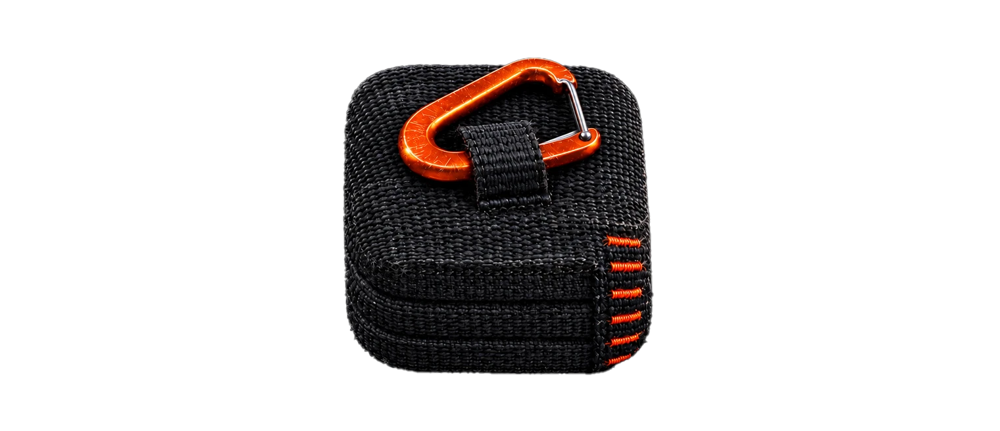
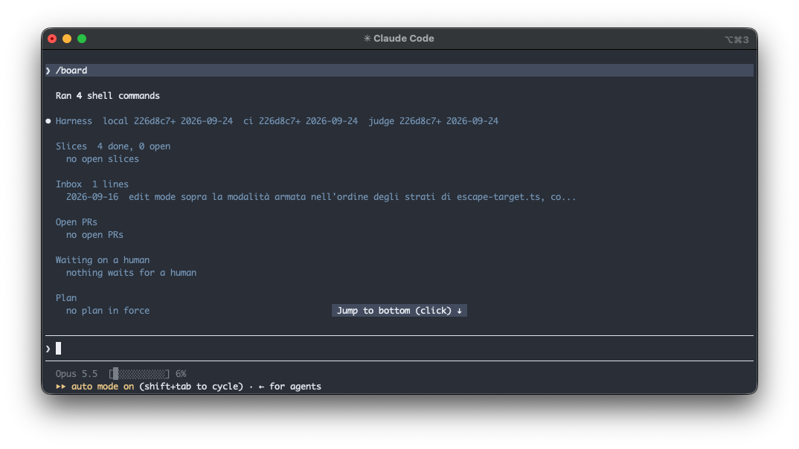
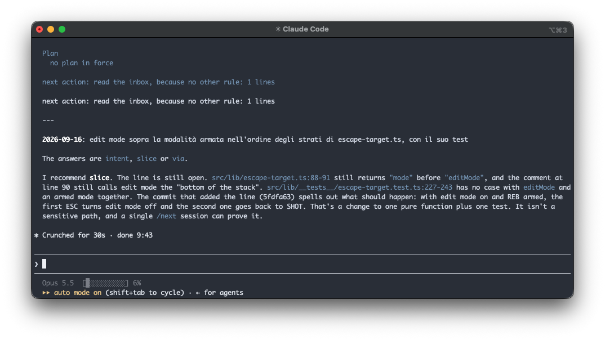
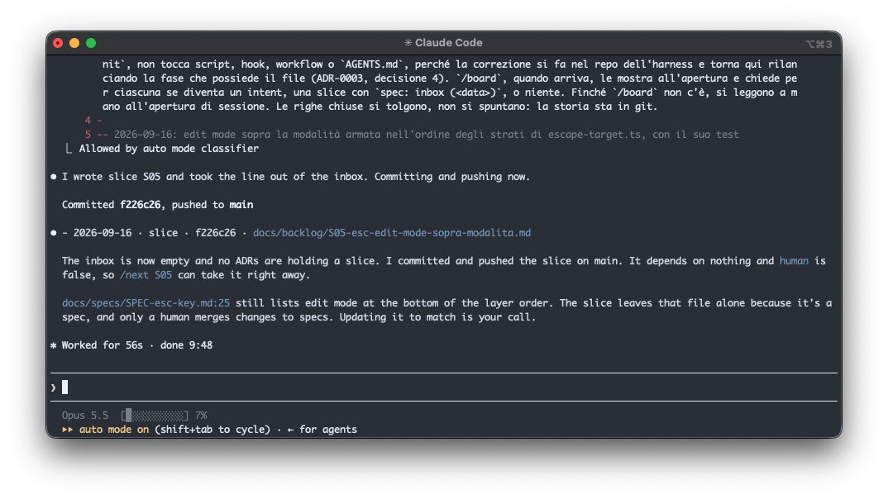
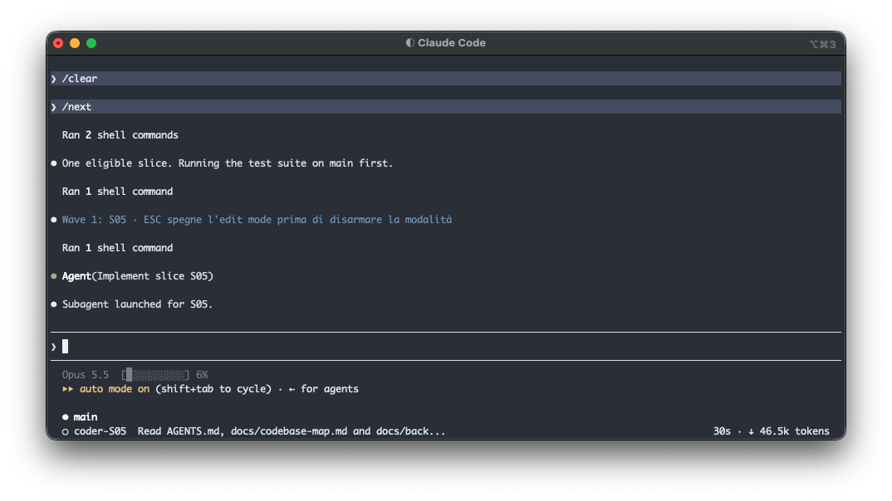

  

# harness

harness is an agent production chain for [Claude Code]. You write ten lines about what you want. The chain interviews you into a spec, cuts the spec into slices, and hands each slice to a subagent at clean context that writes the tests first and opens one pull request. Deterministic gates check it, a judge reads it once, and a policy you can read in `AGENTS.md` merges it or hands it back to you.

- **Review moves before the PR.** Git hooks and CI compute the **tier** of every change from its size and the paths it touches, so a typo fix and a schema migration never get the same scrutiny.
- **One judgement per PR, at clean context.** `/judge` reads the diff, the slice and the repo's rules, and nothing from the session that wrote the code. Findings are answered with the sha of the fixing commit, never with a second judgement.
- **The rules live in the repo.** Hooks, CI gates, the tier table and the merge policy hold for anyone who clones the repo and for CI, with or without Claude Code.
- **No runtime, no service.** Markdown, bash 3.2 with `jq`, GitHub Actions and one JSON schema. No workflow calls a model: the judge runs in your terminal, on your own Claude subscription.
- **Solo or team.** One developer commits documents straight to main. A team routes them through PRs merged by the role that owns them. One key in the policy block switches between the two.

  

`/board` opens a session. It prints the state of the repo on one screen: which stage of the harness each part came from, the slices, the inbox, the open PRs, what waits on a human. Then it picks the next action by a rule, and says which rule.

  

Here the next action is an inbox line written nine days earlier. Before asking, `/board` checks the line against the code as it is today: the bug is still there, the test is still missing, and the fix touches one pure function. So it recommends a slice, and says why.

  

One yes, and the line is now slice S05 in `docs/backlog/`, committed on main. The session also notices that the spec still describes the old behaviour, and leaves that to you, because only a human changes a spec.

  

`/clear`, then `/next`. It finds one eligible slice, runs the suite on main first, and hands S05 to a subagent that starts from `AGENTS.md`, the codebase map and the slice file, and from nothing said in the session before. The subagent writes the test first, then the fix, is judged once, and opens the PR.
[Claude Code]: https://claude.com/claude-code

## Why

Working with a coding agent is slow at the review, not at the writing. An agent produces a PR in minutes and then it waits hours for someone to read it, and when the someone is you, you end up reading every line of every change with the same attention because nothing tells you which ones matter.

The harness makes most of that decision mechanical. The size and the paths of a change set its tier. The tier sets how much judging it needs. The judge reads the change against the slice it was written for, which already holds the acceptance criteria and the decisions of the spec. What is left for the human is the part a machine should not decide: what gets built, which plan is right, and the merges the policy will not make.

## How it works

    L0  Documents       ~/.claude/CLAUDE.md · AGENTS.md · docs/
    L1  Specification   intent  ->  spec  ->  slices (DAG, expected tier, human flag)
    L2  Execution       branch per slice  ->  subagent, tests first  ->  PR from the template
    L3  Gates           git hooks (.githooks/)  ->  deterministic CI  ->  label tier:N
    L4  Judgement       /judge at clean context  ->  verdict  ->  policy.sh  ->  merge | needs-human
    L5  Human           writes the intent · approves spec and board · merges what the policy won't · audits
    L6  Observability   docs/review-log/verdicts.jsonl  ->  audit  ->  threshold tuning

Git hooks refuse code on the default branch and malformed commit messages. CI runs format, typecheck, test, build, a secret scan and a weakened-test check in one job, then computes the tier with `scripts/tier.sh`. The rules it reads are the policy block of `AGENTS.md` **at the base ref**, so a PR cannot widen the rules it is judged by.

| Tier | Means                                                   | Judge     | Merge                                               |
| ---- | ------------------------------------------------------- | --------- | --------------------------------------------------- |
| 0    | prose nobody executes, small docs                       | none      | on green CI                                         |
| 1    | <= 200 lines, <= 8 files, no sensitive path, no new dep | one role  | on approve, or every finding answered               |
| 2    | over the thresholds, sensitive path, dependency, schema | two roles | both approve and no open `high`, else `needs-human` |
| 3    | slice with `human: true`, weakened tests                | none      | human                                               |

The tier says how much scrutiny a change needs. Who may merge is a separate line: the paths listed under human gates in `AGENTS.md` (intent, specs, backlog, decisions, review log) get the `human-gate` label and the policy never merges them, at any tier. Every verdict lands in `docs/review-log/verdicts.jsonl` with the outcome of its PR, which is what the audit will tune the thresholds from.

Layers talk through files, labels and marked comments, never through a conversation. Every session starts at clean context from `AGENTS.md`, the codebase map and the slice.

Everything the chain does on its own sits behind the repo variable `HARNESS_AUTOMERGE`, `off` by default. While it is off, the policy comments what it would have done and a person merges.

## Install

    git clone https://github.com/elrumordelaluz/harness.git
    cd harness
    pnpm install
    mkdir -p ~/.claude/skills
    ln -s "$PWD"/skills/* ~/.claude/skills/

The symlinks point at the working tree: whatever is checked out here is what every command runs in every other repo. Keep this checkout on main and update it with `git pull`.

Then, in the project repo:

    /harness-init local    AGENTS.md, CLAUDE.md, docs/, git hooks, .claude/settings.json
    /harness-init ci       CI gates, tier label, PR template, ruleset
    /harness-init judge    judge prompt and schema, policy, automerge, escalate and close workflows

The three stages land in one PR, merged by hand, because the gates cannot guard the PR that creates them. On an empty repo `local` bootstraps the stack first, from `~/.claude/stack.md` if it exists. The skill does everything `gh` can do and hands you one checklist at the end, usually two items. After the merge, fill `AGENTS.md` and `docs/codebase-map.md` with what is true of that repo: commands, sensitive paths, pitfalls. The judge and the subagents read them and nothing else.

`/harness-init` asks whether the repo is solo or team when it cannot tell. From there the two paths split.

## Path A: solo

One developer, Claude Code, a GitHub repo. This is how the harness has run every day since September 2026.

**Documents go straight to main.** `docs_mode` is `main` in the policy block. Intents, specs, slice boards and inbox lines are written with you in the room, so your yes in the conversation is the approval and the commit is the record. Asking you to merge what you just approved adds nothing.

**A feature, top to bottom:**

    scripts/intent.sh new <slug>    you write ten lines: problem, what success means, out of scope
    scripts/intent.sh open          checks no section is empty, commits on main
    /spec                           one question per message, each with a recommendation, then the spec
    /slice                          slice files in docs/backlog/ and the board, after one yes
    /next                           one subagent per slice, tests first, judged once, one PR each

`/next` is the only command that produces code, and it never writes it itself: each slice gets a subagent at clean context in a worktree of its own, and slices that share no files run in parallel waves.

**Turning on automerge.** Leave `HARNESS_AUTOMERGE` off for the first PRs and read what the policy says it would have done. When that matches what you would have done, install a GitHub App on the repo (merges made with the default token do not start workflows) and set the variable to `on`. An [ntfy](https://ntfy.sh) topic for escalations is optional.

**Your day** is `/board` in the morning, `/next` when slices are ready, a notification when a tier 2 PR needs you, and a line in `docs/inbox.md` whenever you notice something outside the current slice. The next `/board` asks whether each line becomes an intent, a slice, or nothing.

## Path B: team

Several people on one repo, not all of them on Claude Code. The design principle is the one the solo path already follows: **a rule that lives only in a skill does not exist.** Every rule that matters has a twin in the hooks, in CI or in the ruleset, so it holds for the teammate who never opens Claude Code.

**Set it up** with `/harness-init` as above, then:

1. Set `"docs_mode": "pr"` in the policy block of `AGENTS.md`. Intent, spec and board then travel on their own branch (`intent/<slug>`, `spec/<slug>`, `backlog/<slug>`) and the approval is the merge of the role that owns them. The hooks, `intent.sh`, `/spec`, `/slice` and `/board` all read that key.
2. Add a `CODEOWNERS` that covers the sensitive paths listed in `AGENTS.md`, and require one review in the ruleset, so the code owner of a path is the one who merges it.
3. Copy the lines of anyone's personal `~/.claude/stack.md` that the team agrees on into `AGENTS.md`. Personal preferences stay personal.
4. Install the organization's GitHub App on the repo, and point escalations at the team channel instead of a personal ntfy topic.

**Who does what:**

| Gate           | Solo                        | Team                                    |
| -------------- | --------------------------- | --------------------------------------- |
| Intent         | you, commit on main         | product owner, PR merged by them        |
| Spec           | you, yes in the interview   | tech lead, merges `spec/<slug>`         |
| Board          | you, one yes                | engineer who plans, `backlog/<slug>` PR |
| Tier 2 and 3   | you, on a notification      | the code owner of the path              |
| Audit          | you, three PRs a week       | by rotation                             |
| Harness change | prose on main, code in a PR | tier 2 PR with the tech lead's review   |

**Claiming work** is the branch: `slice/S<NN>-<slug>`, pushed at once. If it is already on the remote, the slice is someone else's.

**Teammates without Claude Code** clone the repo, run `pnpm install` and get the hooks, the four gates, the tier label and the PR template like everyone else. Their PRs carry no verdict, so the policy does not merge them above tier 0: a code owner reviews and merges, which is how the repo worked before the harness.

**Honest status.** The team path is implemented and tested (`docs_mode: pr` has its own cases in the suites of the hooks and of `intent.sh`) but it has not yet run on a team. Two things are designed and not built: the board as GitHub Issues with "blocked by" relations, and a home for `verdicts.jsonl` that survives a merge queue, where appending to a file in the repo conflicts. Section 8 of [the spec](docs/spec.md) lists every difference. If you try it on a team, an issue with what broke is the most useful thing you can send.

## Commands

| Command                        | Use it when                                     | What you get                                                        |
| ------------------------------ | ----------------------------------------------- | ------------------------------------------------------------------- |
| `/board`                       | you open a session and don't know what is next  | repo state on one screen, the next action, inbox lines triaged      |
| `scripts/intent.sh new <slug>` | you have an idea                                | an intent skeleton; you write the ten lines, then `intent.sh open`  |
| `/spec`                        | an intent is approved                           | an interview, one question per message, then the approved spec      |
| `/slice`                       | a spec is approved                              | slice files in `docs/backlog/` and the board, after one yes         |
| `/next`                        | slices are ready                                | one judged PR per slice; `/next S12` runs one, no argument runs all |
| `/judge`                       | you open a PR by hand                           | a verdict for the head; `/next` runs it for you                     |
| `/harness-init`                | the repo has no harness, or the templates moved | stages `local`, `ci`, `judge`; one PR, merged by hand               |

**`/next` or `/board`?** `/board` looks and tells you what to do. `/next` does it. If you know a slice is ready, `/next`. Otherwise `/board`.

**Do I run `/judge`?** Only if you open the PR yourself. At tier 1 and 2 a Claude Code hook blocks `gh pr create` until the head has a verdict. Answer findings with a commit (`scripts/judge.sh answer <id> <sha>`), never with a second judgement.

**The templates changed. How does my repo get them?** Each stage leaves its entry in `.harness/stamp.json`, the commit of the harness it copied from. `scripts/since.sh <sha>` says what moved; rerun the stage that owns it. That is the only way updates reach a project.

## Why not a plugin on the marketplace?

Because a plugin ships skills, and the skills are the least important part of the harness.

What makes the chain hold is what `/harness-init` copies into your repo: git hooks, CI workflows, a ruleset, `scripts/tier.sh` and `scripts/policy.sh`, the policy block in `AGENTS.md`, the judge's prompt and verdict schema. A plugin cannot install a ruleset on your default branch, and it should not be what decides whether a PR merges. Those rules belong to the repo, versioned with the code they guard, readable in a diff, and enforced by CI for people and bots that have never heard of Claude Code. That is the whole team story. A chain distributed as a plugin would hold only for whoever has the plugin installed, at whatever version they happen to have.

The copy is deliberate, too. A plugin updates in place and silently. A harness template reaches a project only when someone reruns a stage of `/harness-init` and merges the PR it opens, with `.harness/stamp.json` saying which commit of the harness each stage came from. The rules that judge your code change through review, like the code.

The six skills could be packaged as a plugin on top of this, as a nicer install than symlinks. That would change how you get the commands, not where the rules live.

## Requirements

- Claude Code with a Claude subscription, for the skills and the judge.
- Node 24, pnpm, `jq`, git 2.9 or later, and `gh` authenticated on the repo.
- bash 3.2 is enough: the scripts run on stock macOS without Homebrew, and on the bash of GitHub's runners.
- A GitHub repo. Rulesets need a public repo or a paid plan; without them the default branch is protected by the local hooks and by the policy alone.
- The CI templates assume pnpm and the four scripts `typecheck`, `test`, `format:check` and `build`; `/harness-init` adapts them to the repo.

## Repo layout

    skills/harness-init/     three-stage setup skill (local, ci, judge)
      templates/             files copied into project repos; its README maps destinations
    skills/spec/             intent to spec interview; templates/SPEC.md is the skeleton
    skills/slice/            approved spec to slices and board
    skills/next/             orchestrator: waves, one subagent and worktree per slice, judge, PR
    skills/judge/            clean-context judgement before the PR
    skills/board/            session opener: the screen of scripts/board.sh, inbox triage
    docs/spec.md             the spec; version and date in its header, changes listed in section 0
    docs/codebase-map.md     modules, entry points, how to test, pitfalls
    docs/                    this repo's own harness: intent, specs, backlog, decisions, review-log, inbox
    AGENTS.md, CLAUDE.md     the map for agents, with the policy block the scripts read
    .githooks/, scripts/     symlinks to the templates: the repo runs on its own hooks
    .github/                 copies of the workflow templates, kept equal to them by a test
    tests/                   Vitest suites that run the template scripts as processes

The repo eats its own food: the slices in `docs/backlog/` are how it was built, and `docs/review-log/verdicts.jsonl` is the log of the judgements on its own PRs.

## Develop the harness

    pnpm install        installs the hooks
    pnpm typecheck      tsc on the tests, bash -n on scripts and hooks, jq on JSON
    pnpm test           builds real git repos; about two minutes
    pnpm format:check
    pnpm build          declared no-op

Change a script or hook in `skills/harness-init/templates/`, never through the symlink. Workflows under `.github/` are copies, and a test fails until the copy matches the template. The scripts stay on bash 3.2 and `jq`: no `mapfile`, no associative arrays, no `${var,,}`, and a structural test looks for them because `bash -n` on CI's bash 5 does not. No em dash anywhere: `scripts/prose.sh` fails on one, in the hooks and in CI. Test a skill on a project repo, not here, and read `docs/codebase-map.md` before touching code; its "Dragons" section holds what went wrong before.

Issues and pull requests are welcome. A PR from a fork gets the gates and the tier label but not the automerge: a human reads it and merges it.

## Status

September 2026. Six skills in daily use on the author's repos, more than a hundred verdicts logged, and `HARNESS_AUTOMERGE` on in this repo since 22 September, with the policy merging tier 0 and tier 1 PRs on its own. Not there yet: the audit skill, a team that has run the team path, and thresholds tuned from measurements rather than starting values.

## License

MIT. See `LICENSE`.

---

